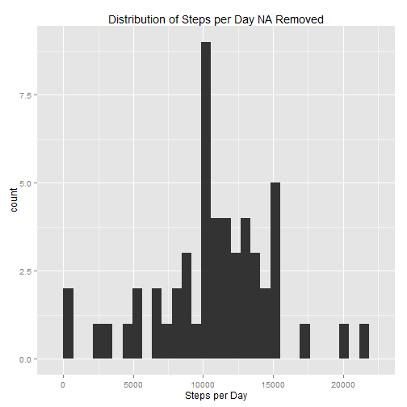
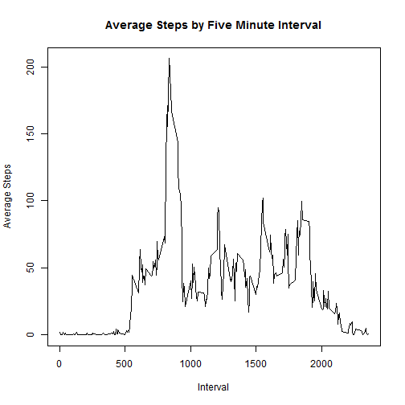
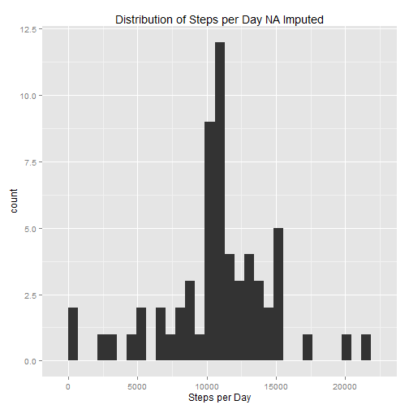

Peer Assessment #1
========================================================

Load the data

```r
act <- read.csv("activity.csv")
```


Process/Transform the data

```r
act$date <- as.Date(act$date, format = "%Y-%m-%d")
unique.dates <- as.data.frame(unique(act$date))
colnames(unique.dates) <- c("date")
b <- aggregate(steps ~ date, data = act, FUN = sum)
almost.final <- merge(b, unique.dates, by = "date", all.y = TRUE)
```


Make a histogram of the total number of steps taken each day

```r
library(ggplot2)
qplot(steps, data = almost.final, geom = "histogram", main = "Distribution of Steps per Day NA Removed", 
    xlab = "Steps per Day")
```

```
## stat_bin: binwidth defaulted to range/30. Use 'binwidth = x' to adjust this.
```

 

```r
dev.off()
```

```
## null device 
##           1
```


Calculate and report the mean and median total number of steps taken per day

```r
summary(almost.final$steps)
```

```
##    Min. 1st Qu.  Median    Mean 3rd Qu.    Max.    NA's 
##      41    8840   10800   10800   13300   21200       8
```


Make a time series plot (i.e. type = "l") of the 5-minute interval (x-axis) and the average number of steps taken, averaged across all days (y-axis)

```r
# png('C:/Users/wein0339/Desktop/Dropbox/Coursera/Reproducible
# Research/Assignment 1/figures/plot1.png', width = 480, height = 480)
c <- aggregate(steps ~ interval, data = act, FUN = mean)
plot(steps ~ interval, type = "l", data = c, main = "Average Steps by Five Minute Interval", 
    xlab = "Interval", ylab = "Average Steps")
```

 

```r
dev.off()
```

```
## null device 
##           1
```


Which 5-minute interval, on average across all the days in the dataset, contains 
the maximum number of steps?

```r
c[which.max(c$steps), ]
```

```
##     interval steps
## 104      835 206.2
```

Interval 835 with 206.16 steps on average per day

Calculate and report the total number of missing values in the dataset 
(i.e. the total number of rows with NAs)

```r
(table(complete.cases(act)))
```

```
## 
## FALSE  TRUE 
##  2304 15264
```

```r
sum(complete.cases(act))/nrow(act)
```

```
## [1] 0.8689
```

15,264 Rows are complete out of a total of 17,568 (86.8%)

Devise a strategy for filling in all of the missing values in the dataset. The strategy does not need to be sophisticated. For example, you could use the mean/median for that day, or the mean for that 5-minute interval, etc.

change column names for mean.steps

```r
colnames(c) <- c("interval", "mean.steps")
```


merge complete file with mean.steps for each interval

```r
act.impute <- merge(x = act, y = c, by = "interval", all.x = TRUE)
```


impute missing values for steps with the mean value for that interval

```r
act.impute$impute.steps <- ifelse(is.na(act.impute$steps) == TRUE, act.impute$mean.steps, 
    act.impute$steps)
```


Create a new dataset that is equal to the original dataset but with the missing data filled in.

```r
act.new <- act.impute[, c("impute.steps", "date", "interval")]
```


Make a histogram of the total number of steps taken each day and Calculate and 
report the mean and median total number of steps taken per day. Do these values 
differ from the estimates from the first part of the assignment? What is the impact 
of imputing missing data on the estimates of the total daily number of steps?

aggregate imputed steps by date

```r
d <- aggregate(impute.steps ~ date, data = act.new, FUN = sum)
almost.final.1 <- merge(d, unique.dates, by = "date", all.y = TRUE)
```


plot histogram of impute steps by day

```r
qplot(impute.steps, data = almost.final.1, geom = "histogram", main = "Distribution of Steps per Day NA Imputed", 
    xlab = "Steps per Day")
```

```
## stat_bin: binwidth defaulted to range/30. Use 'binwidth = x' to adjust this.
```

 

```r
dev.off()
```

```
## null device 
##           1
```


calculate summaries for non-imputed vs. imputed data

```r
summary(almost.final)
```

```
##       date                steps      
##  Min.   :2012-10-01   Min.   :   41  
##  1st Qu.:2012-10-16   1st Qu.: 8841  
##  Median :2012-10-31   Median :10765  
##  Mean   :2012-10-31   Mean   :10766  
##  3rd Qu.:2012-11-15   3rd Qu.:13294  
##  Max.   :2012-11-30   Max.   :21194  
##                       NA's   :8
```

```r
summary(almost.final.1)
```

```
##       date             impute.steps  
##  Min.   :2012-10-01   Min.   :   41  
##  1st Qu.:2012-10-16   1st Qu.: 9819  
##  Median :2012-10-31   Median :10766  
##  Mean   :2012-10-31   Mean   :10766  
##  3rd Qu.:2012-11-15   3rd Qu.:12811  
##  Max.   :2012-11-30   Max.   :21194
```


The differences are fairly small, especially in the measures of central
tendency. It appears as though the distribution moved around the 
averages slightly with 1st quartile increasing and the 3rd decreasing

Build a variable separating the week from the weekend

```r
act.new$day <- weekdays(act$date)
act.new$day.weekend <- ifelse(act.new$day == "Saturday" | act.new$day == "Sunday", 
    "Weekend", "Weekday")
```


aggregate average number of steps by the interval and the weekend

```r
e <- aggregate(impute.steps ~ interval + day.weekend, data = act.new, FUN = mean)
```


produce line plot

```r
library(lattice)
# png('C:/Users/wein0339/Desktop/Dropbox/Coursera/Reproducible
# Research/Assignment 1/figures/plot3.png', width = 480, height = 480)
xyplot(impute.steps ~ interval | day.weekend, layout = c(1, 2), data = e, type = "l", 
    xlab = "Interval", ylab = "Average Number of Steps", main = "Average Steps by Time Interval Weekend vs. Weekdays")
```

 

```r
dev.off()
```

```
## null device 
##           1
```


